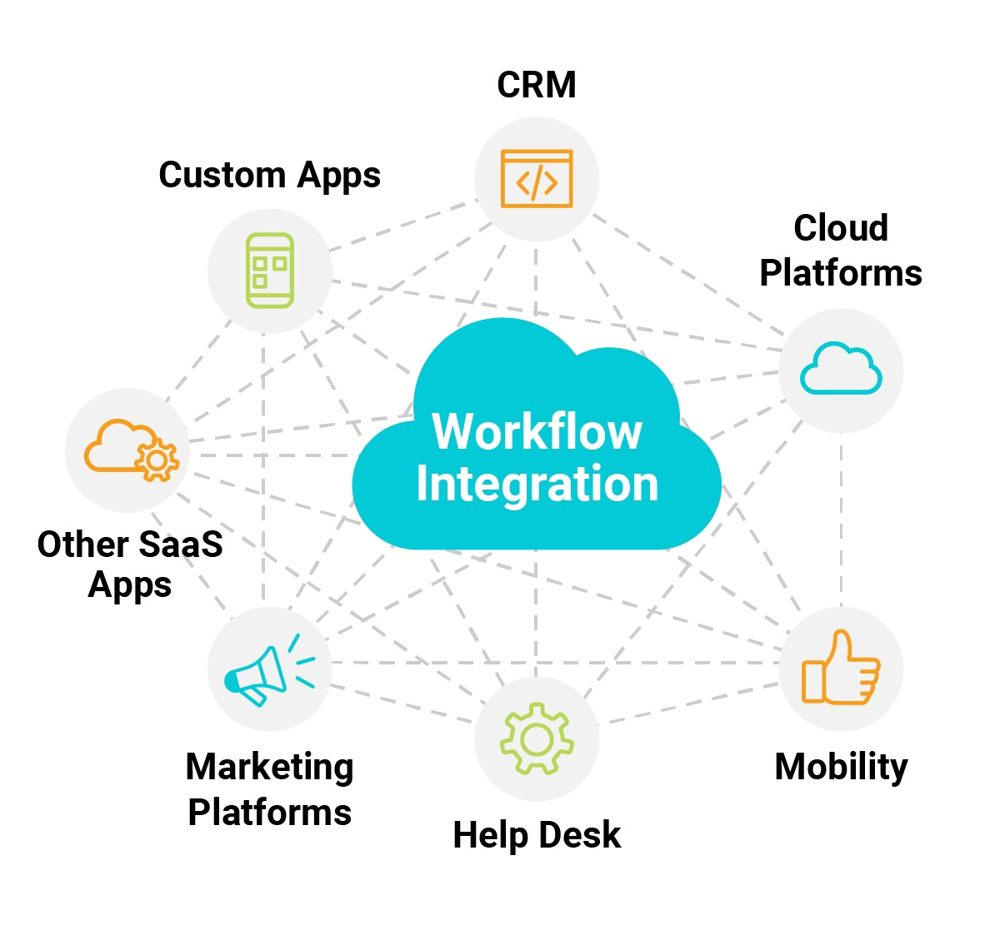

# Workflow Manager for Liquid JavaScript Billing Systems



## Overview

Welcome to the Workflow Manager for Liquid JavaScript Billing Systems! This powerful tool is designed to simplify and enhance the management, optimization, and troubleshooting of billing workflows, especially for platforms like Zuora integrated with Salesforce. This README will guide you through the features, setup, and usage of the Workflow Manager.

## Features

- **Workflow Analysis and Troubleshooting:** Automatically detect and resolve issues related to payment applications, bill run schedules, and rebate applications.
- **Workflow Enhancement:** Update and enhance workflows to ensure accurate processing of all transactions.
- **Synchronization Fixes:** Implement synchronization fixes to maintain data consistency between the billing platform and Salesforce.
- **Error Handling and Reporting:** Develop robust error handling and reporting mechanisms to keep users informed and systems running smoothly.
- **Custom Integrations:** Manage integrations between billing systems, Salesforce, and other platforms for seamless data management.

## Prerequisites

Before you begin, ensure you have met the following requirements:

- Node.js and npm installed on your machine.
- Access to a Zuora account with the necessary permissions for workflow and billing system modifications.
- Access to a Salesforce account with permissions to configure and manage integrations.

## Installation

1. **Clone the Repository:**

   ```sh
   git clone https://github.com/yourusername/workflow-manager.git
   cd workflow-manager
   ```

2. **Install Dependencies:**

   ```sh
   npm install
   ```

3. **Set Up Environment Variables:**

   Create a `.env` file in the root directory and add your Zuora and Salesforce credentials:

   ```env
   ZUORA_CLIENT_ID=yourZuoraClientId
   ZUORA_CLIENT_SECRET=yourZuoraClientSecret
   SALESFORCE_USERNAME=yourSalesforceUsername
   SALESFORCE_PASSWORD=yourSalesforcePassword
   SALESFORCE_TOKEN=yourSalesforceToken
   ```

## Configuration

Configure the billing workflows and synchronization settings in the `config.js` file. This file includes settings for bill run schedules, error handling, and notification settings.

```js
module.exports = {
  BILL_RUN_SCHEDULE: '0 0 * * *', // Daily at midnight
  ERROR_NOTIFICATION_EMAIL: 'admin@example.com',
  SYNC_INTERVAL: 60, // Sync every 60 minutes
  ... // Other configurations
};
```

## Usage

1. **Start the Application:**

   ```sh
   npm start
   ```

   The application will begin monitoring and managing workflows according to the configured settings.

2. **Access Dashboard:**

   Open your browser and navigate to `http://localhost:3000` to access the workflow management dashboard. This interface allows you to view workflow statuses, error reports, and manage configurations.

## Logging

Logs are available in the `logs/` directory and can be used to monitor activity, errors, and system performance.

## Error Handling

The application includes built-in mechanisms to detect and log errors. Critical issues will be emailed to the configured admin email address. For less critical issues, refer to the logs for more detailed information.

## Support

For any support requests, please open an issue on the GitHub repository or contact our support team at support@example.com.

## Contributing

We welcome contributions! Please see our [CONTRIBUTING.md](CONTRIBUTING.md) file for more details on how to get involved.

## License

This project is licensed under the MIT License - see the [LICENSE](LICENSE) file for details.
